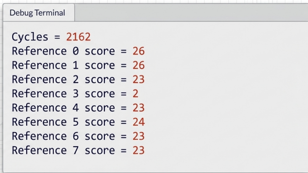
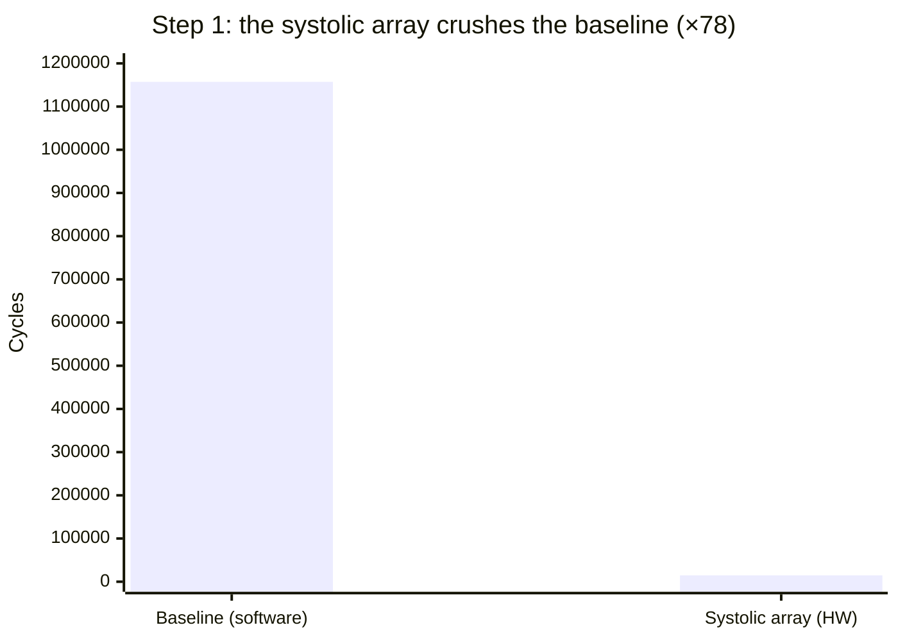
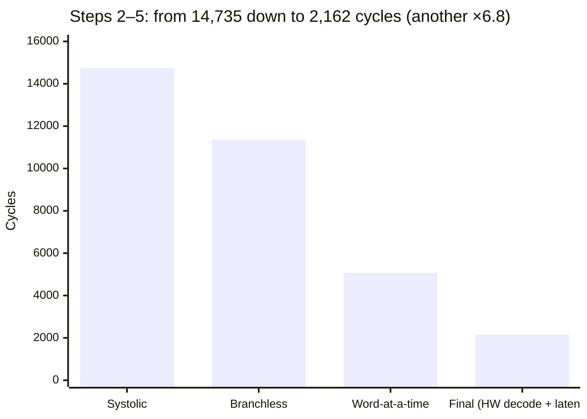
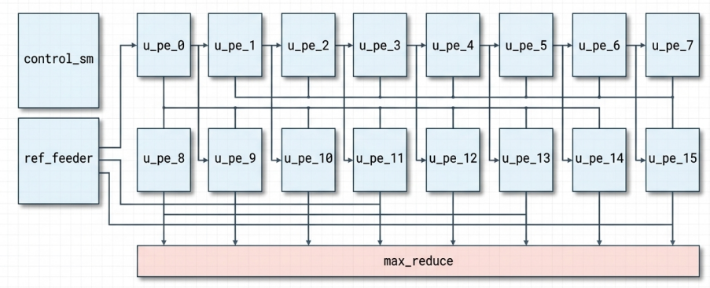
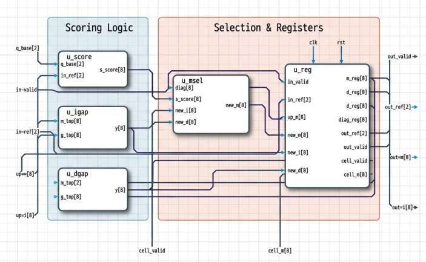
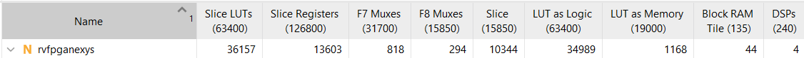
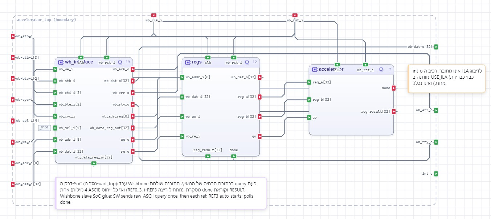

<div align="center">

# 🧬 Hardware-Accelerated DNA Sequence Matching on RISC-V

### A query-stationary systolic Smith–Waterman engine for the VeeR EL2 SoC

**⚡ ×535 faster than software — 1,157,276 → 2,162 cycles**

[](#-results)
[](#-the-story)
[](#-platform)
[](#-platform)
[](#-design-highlights)


</div>

---

## 🏆 The Story

This project was built for the **Hebrew University of Jerusalem (HUJI) VLSI Hackathon 2025** — a competition focused on hardware acceleration for RISC-V processors.

> ### 🎉 Out of **30 teams**, we reached the **finals as one of only 7 pairs**.

We took a classic bioinformatics workload — **Smith–Waterman local alignment with affine gap penalties** — that ran in over a million cycles in pure software, and rebuilt it as a custom hardware accelerator wired directly into the RISC-V core. The result is a **×535.28 speedup** while using **zero DSP slices and zero block RAM** in the accelerator itself (add/max-only datapath).

**Team:** Maoz Epstein · Eyal Allegro

---

## ⚡ Results

The full workload aligns **one 16-base query against 8 reference sequences**.

| Metric | Software baseline | Hardware-accelerated | Improvement |
|---|--:|--:|:--:|
| **Total latency** | 1,157,276 cycles | **2,162 cycles** | **×535.28** |
| Wall-clock @ 100 MHz | ~11.6 ms | **~21.6 µs** | — |

<div align="center">

<br/><em>On-chip output — identical scores to the software reference, in 2,162 cycles.</em>
</div>

### The road from 1.1M → 2.2K cycles

Every optimization was measured on real hardware. Each step attacked the next bottleneck:

| # | Optimization | Cycles | Speedup so far |
|--:|---|--:|--:|
| 0 | Pure-software Smith–Waterman (baseline) | 1,157,276 | ×1 |
| 1 | Query-stationary **systolic array** in hardware | 14,735 | ×78 |
| 2 | **Branchless** software encode | 11,369 | ×102 |
| 3 | **Word-at-a-time** processing | 5,069 | ×228 |
| 4 | **ASCII decoding moved into hardware** (zero SW encode) | — | — |
| 5 | **Latency minimization** (removed redundant pipeline registers) | **2,162** | **×535** |

**The big picture — software vs. hardware:** moving the core into the systolic array alone collapses the workload by ~78×, which is why everything after it looks tiny on a linear axis.



**Zooming in — the optimizations didn't stop there.** After the array, four more rounds of tuning squeezed it down by another **~6.8×**, from 14,735 to the final 2,162 cycles:



---

## 🧠 How It Works

### The algorithm
Smith–Waterman with **affine gap penalties** finds the best-scoring local alignment between two sequences using three dynamic-programming matrices:

```
s      = (query == ref) ? +2 : -1               // match / mismatch
I(i,j) = max( M(i-1,j) + GAP_OPEN , I(i-1,j) + GAP_EXT )   // gap in reference
D(i,j) = max( M(i,j-1) + GAP_OPEN , D(i,j-1) + GAP_EXT )   // gap in query
M(i,j) = max( 0 , M(i-1,j-1) + s , I(i,j) , D(i,j) )       // best alignment
score  = max over all M(i,j)
```
Penalties: `MATCH=+2`, `MISMATCH=-1`, `GAP_OPEN=-4`, `GAP_EXT=-1`.

### The hardware: a query-stationary systolic array
Instead of computing the DP matrix cell-by-cell, **16 Processing Elements (PEs)** — one per query base — are chained together. The query is loaded once and held stationary; reference bases stream through one per cycle. Each anti-diagonal of the matrix is computed in parallel, so the whole alignment finishes in `QLEN + REFLEN + 2` cycles instead of `QLEN × REFLEN` iterations.

<div align="center">

<br/><em>16 chained PEs · a control FSM · a reference feeder · and a combinational <code>max_reduce</code> for the global best score.</em>
</div>

### Inside a single Processing Element
Each PE holds its query base and computes the `M`/`I`/`D` recurrences with **saturating signed arithmetic** — using only adders and comparators (**no multipliers**).

<div align="center">

</div>

---

## ✨ Design Highlights

- **0 DSPs, 0 Block RAMs** in the accelerator — the entire datapath is add/max only.
- **Query-stationary dataflow** turns an O(N×M) nested loop into an O(N+M) streaming pipeline.
- **Hardware ASCII decoding** — the CPU ships *raw* ASCII bytes (4 bases per 32-bit word); the accelerator decodes `A/C/G/T → 2-bit` on-chip, eliminating all software encoding overhead.
- **8-bit saturating datapath** — Python analysis confirmed `W≥6` already matches reference scores; `W=8` was chosen for headroom.
- **Bit-exact** with the software reference across all 8 test sequences.

---

## 🔌 Platform

| | |
|---|---|
| **Core** | [VeeR EL2](https://github.com/chipsalliance/Cores-VeeR-EL2) (RV32) — Western Digital / CHIPS Alliance |
| **SoC** | RVfpga / VeeRwolf (Wishbone interconnect) |
| **Board** | Digilent **Nexys A7** (Xilinx Artix-7) |
| **Clock** | 100 MHz |
| **Toolchain** | Vivado (RTL/bitstream) · SEGGER Embedded Studio (firmware) |

### FPGA resource utilization (full SoC)
<div align="center">

</div>

> The 4 DSPs and the block RAM shown belong to the base RVfpga SoC — **the Smith–Waterman accelerator adds none of them.**

### CPU ↔ accelerator integration (Wishbone)
<div align="center">

</div>

The accelerator is a memory-mapped Wishbone peripheral (base `0x80001300`). Firmware writes the query/reference ASCII words, the final reference write auto-starts the run, and the CPU polls a `DONE` bit before reading the score.

---

## 📁 Repository Layout

```
.
├── RVfpgaEL2_01/
│   ├── rtl/VeeRwolf/Peripherals/accelerator_hackaton/
│   │   ├── accelerator.sv        # ← the systolic Smith–Waterman core (PE + array)
│   │   ├── accelerator_regs.sv   # memory-mapped register file
│   │   └── accelerator_wb.sv     # Wishbone bus wrapper
│   ├── sw/dna_match/             # firmware: driver + software reference
│   │   └── Source/dna_match.c    # ← host code, accelerator driver & SW fallback
│   └── vivado/                   # Vivado project & constraints (Nexys A7)
├── docs/images/                  # diagrams & results used in this README
├── Final Presentation.pptx       # final-round presentation
└── 535x_Genomic_Pipeline_Acceleration.pdf
```

---

## 🚀 Build & Run

### Hardware (Vivado)
1. Open the Vivado project under `RVfpgaEL2_01/vivado/`.
2. Generate the bitstream and program the **Nexys A7**.

### Firmware (SEGGER Embedded Studio)
1. Open `RVfpgaEL2_01/sw/dna_match/dna_match.emProject`.
2. Build and download to the core; results print over the debug terminal.

To compare against the pure-software path, comment out `#define USE_ACCELERATOR` in
[`dna_match.c`](RVfpgaEL2_01/sw/dna_match/Source/dna_match.c) — both paths produce identical scores.

---

## 🙏 Acknowledgements

Built on the RVfpga / VeeR EL2 platform and the Hackathon preparation-exercise accelerator skeleton.
Thanks to the **HUJI Applied Physics** department and the VLSI Hackathon 2025 organizers and mentors.

<div align="center">

**Made with ☕ and a lot of cycles by Maoz Epstein & Eyal Allegro**

</div>
